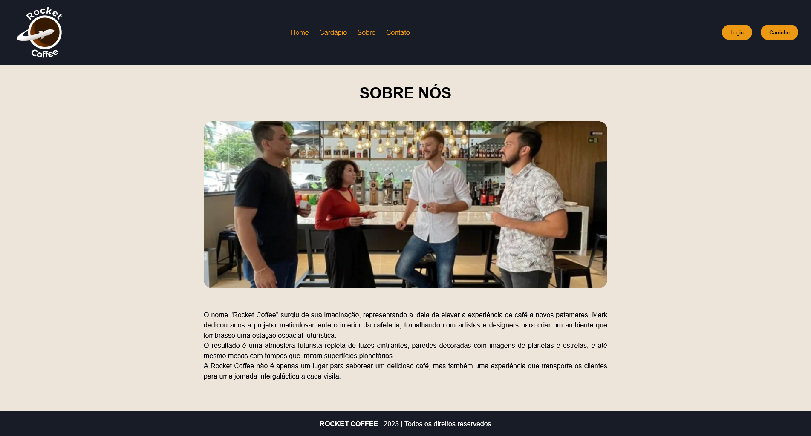
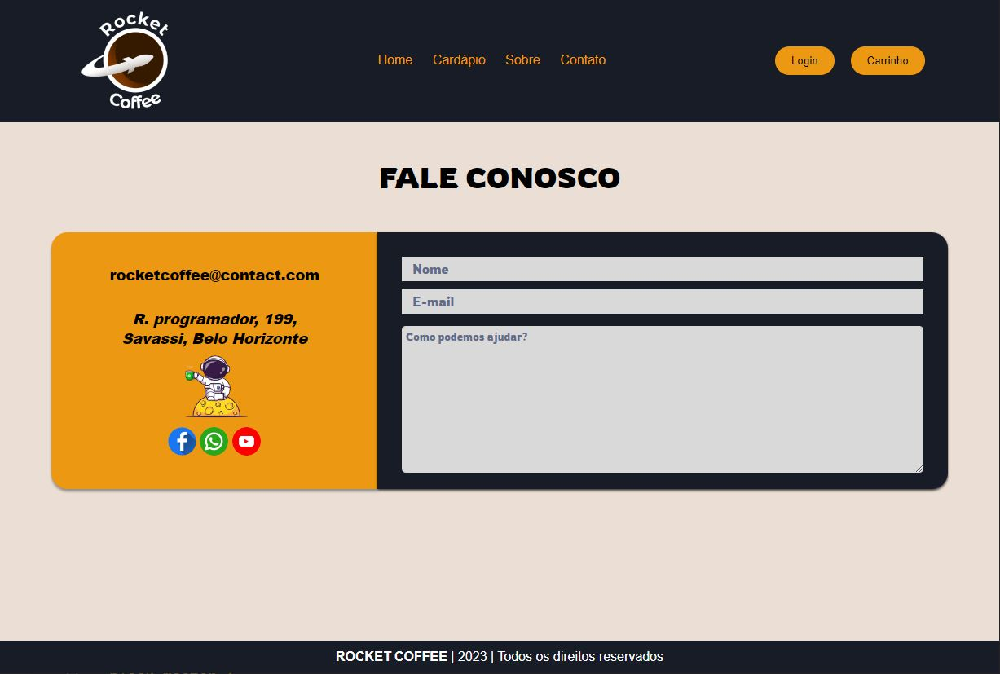

# Template padrão da Aplicação

O layout padrão do site foi construído com as linguagens de marcação HTML e CSS, e a linguagem de programação JavaScript foi utilizada para a construção do menu responsivo.

As páginas terão como elementos padrões o menu de navegação, o header e o footer, além dos elementos de identidade visual citados abaixo:

<ul>
<li>Cores: black; white; #ed9812; #593f30; </li>
<li>Font-family: Roboto,sans-serif.</li>
<li>Font-size: H1 - 48px; H2 - 36px; H3 - 28px;  </li>
</ul>
  
O código utilizado para a construção dos elementos citados, incluindo a responsividade, pode ser consultado <a href="https://github.com/ICEI-PUC-Minas-PMV-ADS/pmv-ads-2023-2-e1-proj-web-t1-expresso-virtual/tree/main/codigo-fonte">aqui</a>. As imagens e ícones utilizados no projeto estão disponíveis <a href="https://github.com/ICEI-PUC-Minas-PMV-ADS/pmv-ads-2023-2-e1-proj-web-t1-expresso-virtual/tree/main/documentos/img">aqui</a>.

O logotipo do site foi cuidadosamente criado com uma combinação de cores que transmitem significados específicos. A escolha das cores amarela e azul foi intencional, pois cada uma delas carrega uma mensagem distintamente positiva.

O azul foi escolhido por sua associação com a confiança, inteligência e comunicação. Estudos têm comprovado que o azul é considerado a cor da inteligência e está fortemente ligado à confiança. Além disso, é a cor mais relacionada com a comunicação, transmitindo uma sensação de confiabilidade e credibilidade.

Já o amarelo, como parte da paleta quente, transmite serenidade, alegria e calor. É uma cor vibrante que naturalmente atrai atenção, sendo percebida de forma rápida, especialmente na visão periférica. Sua tonalidade brilhante e alegre complementa a mensagem do logotipo, trazendo uma sensação acolhedora e otimista.

Assim, a combinação de azul e amarelo no logotipo do site foi estrategicamente planejada para transmitir confiança, inteligência, alegria e calor, oferecendo uma primeira impressão visual marcante e acolhedora aos visitantes. 

<h3><b>Home Page</b></h3>

Exibe informações sobre itens do cardápio, botões de login, e acesso ao cardápio, contato e sobre nós.

<figure> 
  
  <figcaption> Figura 17 - Tela de Homepage
</figure> 

<h3><b>Página Sobre Nós</b></h3>

Exibe informações sobre a cafeteria e sua história .

<figure> 
  
  <figcaption>Figura 18 - Tela de Sobre Nós    
</figure> 

<figure> 
  
    <figcaption>Figura 19 - Tela Fale Conosco
</figure> 

<figure> 
  
    <figcaption>Figura 20 - Tela Carrinho
</figure> 
