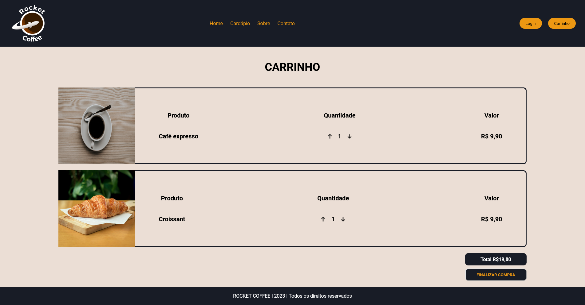

# Template padrão da Aplicação

O layout padrão do site foi construído com as linguagens de marcação HTML e CSS, e a linguagem de programação JavaScript foi utilizada para a construção do menu responsivo.

As páginas terão como elementos padrões o menu de navegação, o header e o footer, além dos elementos de identidade visual citados abaixo:

<ul>
<li>Cores: black; white; #ed9812; #593f30; </li>
<li>Font-family: Roboto,sans-serif.</li>
<li>Font-size: H1 - 48px; H2 - 36px; H3 - 28px;  </li>
</ul>
  
O código utilizado para a construção dos elementos citados, incluindo a responsividade, pode ser consultado <a href="https://github.com/ICEI-PUC-Minas-PMV-ADS/pmv-ads-2023-2-e1-proj-web-t1-expresso-virtual/tree/main/codigo-fonte">aqui</a>. As imagens e ícones utilizados no projeto estão disponíveis <a href="https://github.com/ICEI-PUC-Minas-PMV-ADS/pmv-ads-2023-2-e1-proj-web-t1-expresso-virtual/tree/main/documentos/img">aqui</a>.

Para a criação do logotipo do site foi utilizada a cor amarela e azul, pois estas cores juntas remetem a O azul passa confiança, Esta cor foi comprovada como a cor da inteligência, da comunicação e da confiança. É também a cor mais associada à comunicação. O amarelo é uma cor da paleta quente, e remete a algo sereno, alegre e, como não poderia deixar de ser, quente. Essa tonalidade é a que percebemos de forma mais rápida, em especial, na visão periférica.  

<h3><b>Home Page</b></h3>

Exibe informações sobre itens do cardápio, botões de login, e acesso ao cardápio, contato e sobre nós.

<figure> 
  
  <figcaption> Figura 1 - Tela de Homepage
</figure> 

<h3><b>Página Sobre Nós</b></h3>

Exibe informações sobre a cafeteria e sua história .

<figure> 
  
  <figcaption>Figura 2 - Tela de Sobre Nós    
</figure> 

<figure> 
  
    <figcaption>Figura 3 - Tela Fale Conosco
</figure> 

<figure> 
  
    <figcaption>Figura 4 - Tela Carrinho
</figure> 