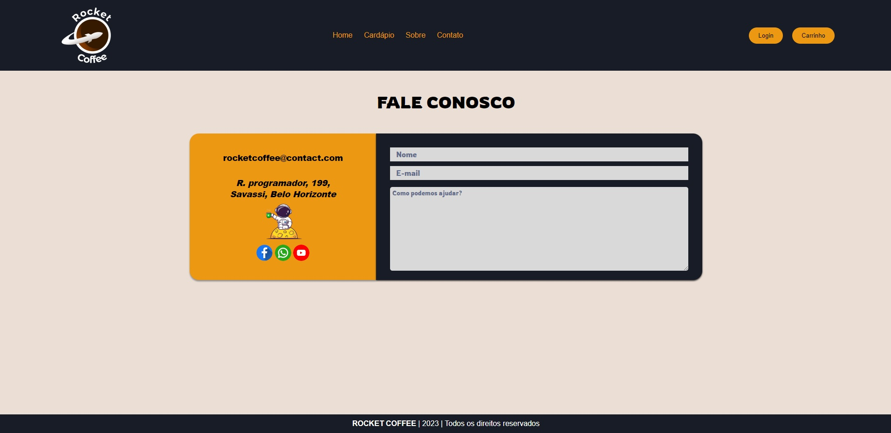

# Programação de Funcionalidades

Implementação da aplicação descritas por meio dos requisitos codificados.

### Tela do Cardápio (RF-01)
O acesso a tela de cardápio poderá ser feito através da opção do menu “Cardápio”. As estruturas de dados foram baseadas em HTML, CSS e JS.

Exemplo de tela de cardápio:

#### Requisito atendido

RF-01: A aplicação deve permitir que o usuário visualize todos os produtos, preços e seus ingredientes, antes da compra.

#### Artefatos da funcionalidade

● menu.html

● products.js

● menu-responsivo.js

● menu.css

#### Estrutura de Dados

● [menu.html](https://github.com/ICEI-PUC-Minas-PMV-ADS/pmv-ads-2023-2-e1-proj-web-t1-expresso-virtual/blob/main/codigo-fonte/Menu-page/menu.html)

#### Instruções de acesso

Clicando em cardapio no menu irá aparecer os produtos disponiveis para adicionar ao carrinho.

#### Responsável

Responsável: Laura

### Tela do Carrinho (RF-02)
O acesso a tela de carrinho poderá ser feito através da opção de menu “Carrinho”. As estruturas de dados foram baseadas em HTML, CSS e JS.

Exemplo de tela de carrinho:

#### Requisito atendido

RF-02: A aplicação deve permitir que o usuário compre os produtos através de um carrinho de compras.

#### Artefatos da funcionalidade

● cart.html

● script.js

● Menu-responsivo.js

● cart-page.css

#### Estrutura de Dados

● [cart.html](https://github.com/ICEI-PUC-Minas-PMV-ADS/pmv-ads-2023-2-e1-proj-web-t1-expresso-virtual/blob/main/codigo-fonte/Cart-Page/cart.html)

#### Instruções de acesso

Clicando em "carrinho" no menu, vai aparecer todos os seus produtos adicionados ao carrinho.

#### Responsável

Responsável: Laura

### Tela do Cadastro (RF-03)

O acesso a tela de cadastro poderá ser feito através da opção de menu “Login”. As estruturas de dados foram baseadas em HTML, CSS e JS.

Exemplo de tela de cadastro:

#### Requisito atendido

RF-03: A aplicação deve permitir que o usuário consiga se cadastrar

#### Artefatos da funcionalidade

● login.html

● Menu-responsivo.js

● login.js

● janela-login.css

#### Estrutura de Dados

● [login.html](https://github.com/ICEI-PUC-Minas-PMV-ADS/pmv-ads-2023-2-e1-proj-web-t1-expresso-virtual/blob/main/codigo-fonte/pagina-login/login.html)

#### Instruções de acesso

A tela de cadastro poderá ser utilizada através do menu no botão “login” onde o usuario vai ir em "Cadastre-se" e irá preencher os dados.

#### Responsável

Responsável: Vitor

### Tela do Fale Conosco (RF-04)
O acesso a tela de Contato poderá ser feito através da opção de menu “Contato”. As estruturas de dados foram baseadas em HTML, CSS.

Exemplor de tela Fale-Conosco:

#### Requisito não atendido

RF-04: A aplicação deve permitir que o usuário consiga enviar tickets para o suporte

#### Artefatos da funcionalidade

● contact.html

● contact.css

● menu-responsivo.js

#### Estrutura de Dados

● [contact.html](https://github.com/ICEI-PUC-Minas-PMV-ADS/pmv-ads-2023-2-e1-proj-web-t1-expresso-virtual/blob/main/codigo-fonte/Contact-page/contact.html)

#### Instruções de acesso

clicanco em "contato" na navbar aparecerá a pagina, e ao visualizar os campos, deve preenchê los e enviar. 

#### Responsável

Responsável: Lucas Gonçalves

### Tela do Login (RF-05)
O acesso a tela de Login poderá ser feito através da opção de menu “Login”. As estruturas de dados foram baseadas em HTML, CSS e JS

Exemplo de tela de login:

#### Requisito atendido

RF-05: A aplicação deve permitir que o usuário consiga se logar

#### Artefatos da funcionalidade

● login.html

● janela-login.css

● script-login.js

● crudLogin.js

● menu-responsivo.js

#### Estrutura de Dados

● [login.html](https://github.com/ICEI-PUC-Minas-PMV-ADS/pmv-ads-2023-2-e1-proj-web-t1-expresso-virtual/blob/main/codigo-fonte/pagina-login/login.html)

#### Instruções de acesso

O acesso a tela de login poderá ser feito através do menu “login” onde o usuario poderá colocar suas informações.

#### Responsável

Responsável: Vitor

