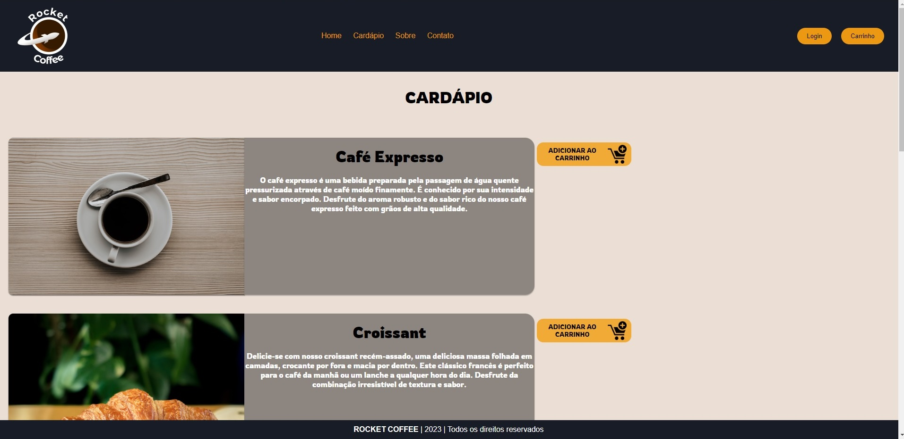
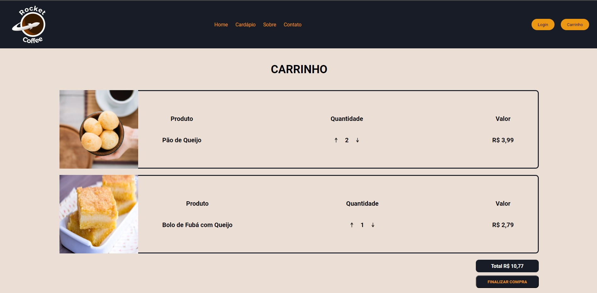
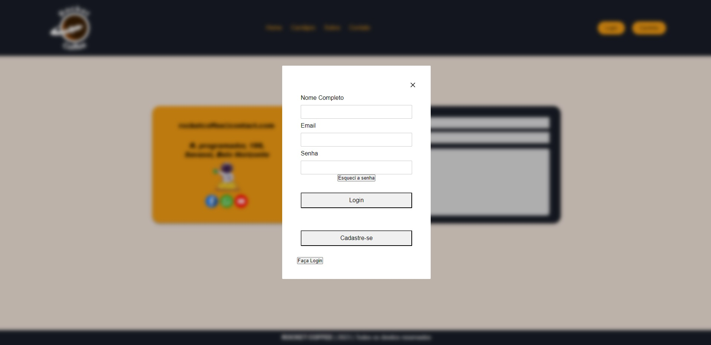

# Programação de Funcionalidades

Implementação da aplicação descritas por meio dos requisitos codificados. 

### Tela do Cardápio

#### Requisito atendido

RF-01 	A aplicação deve permitir que o usuário visualize todos os produtos, preços e seus ingredientes, antes da compra.

#### Artefatos da funcionalidade

● menu.html

● products.js

● menu-responsivo.js

● menu.css

#### Estrutura de Dados

[menu.html](https://github.com/ICEI-PUC-Minas-PMV-ADS/pmv-ads-2023-2-e1-proj-web-t1-expresso-virtual/blob/main/codigo-fonte/Menu-page/menu.html)

#### Instruções de acesso

[Adicione as orientações de acesso à funcionalidade]

#### Responsável

Responsável: Laura

### Tela do Carrinho

#### Requisito atendido

RF-02 	A aplicação deve permitir que o usuário compre os produtos através de um carrinho de compras.

#### Artefatos da funcionalidade

● cart.html

● script.js

● Menu-responsivo.js

● cart-page.css

#### Estrutura de Dados

[cart.html](https://github.com/ICEI-PUC-Minas-PMV-ADS/pmv-ads-2023-2-e1-proj-web-t1-expresso-virtual/blob/main/codigo-fonte/Cart-Page/cart.html)

#### Instruções de acesso

[Adicione as orientações de acesso à funcionalidade]

#### Responsável

Responsável: Laura

### Tela do Cadastro

O acesso a tela de cadastro poderá ser feito através da opção de menu “Cadastre-se”. As estruturas de dados foram baseadas em HTML, CSS e JS.

Exemplo de tela de cadastro:

#### Requisito atendido

RF-03 A aplicação deve permitir que o usuário consiga se cadastrar 

#### Artefatos da funcionalidade

● login.html

● Menu-responsivo.js

● login.js

● janela-login.css

#### Estrutura de Dados

[login.html](https://github.com/ICEI-PUC-Minas-PMV-ADS/pmv-ads-2023-2-e1-proj-web-t1-expresso-virtual/blob/main/codigo-fonte/pagina-login/login.html)

#### Instruções de acesso

[O acesso a tela de cadastro poderá ser feito através do menu “login”. As estruturas de dados foram baseadas em HTML, CSS e JS.]

#### Responsável

Responsável: Vitor

### Tela do Fale Conosco

#### Requisito atendido

RF-04 	A aplicação deve permitir que o usuário consiga enviar tickets para o suporte

#### Artefatos da funcionalidade

● contact.html

● contact.css

● menu-responsivo.js

#### Estrutura de Dados

[contact.html](https://github.com/ICEI-PUC-Minas-PMV-ADS/pmv-ads-2023-2-e1-proj-web-t1-expresso-virtual/blob/main/codigo-fonte/Contact-page/contact.html)

#### Instruções de acesso

[clicanco em "contato" na navbar aparecerá a pagina, e ao visualizar os campos, deve prenchelos e enviar. As estruturas de dados foram baseadas em HTML, CSS e JS.]

#### Responsável

Responsável: Lucas Gonçalves

### Tela do Login

#### Requisito atendido

RF-05 	A aplicação deve permitir que o usuário consiga se logar

#### Artefatos da funcionalidade

● login.html

● janela-login.css

● script-login.js

● crudLogin.js

● menu-responsivo.js

#### Estrutura de Dados

[login.html](https://github.com/ICEI-PUC-Minas-PMV-ADS/pmv-ads-2023-2-e1-proj-web-t1-expresso-virtual/blob/main/codigo-fonte/pagina-login/login.html)

#### Instruções de acesso

[O acesso a tela de login poderá ser feito através do menu “login”. As estruturas de dados foram baseadas em HTML, CSS e JS.]

#### Responsável

Responsável: Vitor