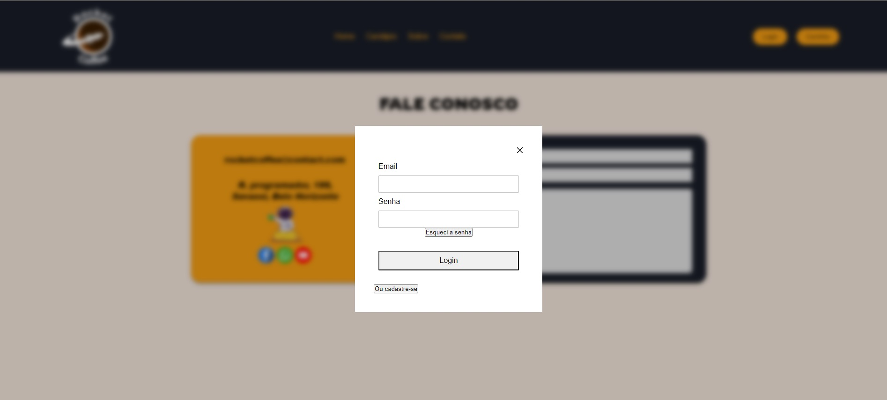

# Programação de Funcionalidades

Implementação da aplicação descritas por meio dos requisitos codificados.

### Tela do Cardápio
O acesso a tela de cardápio poderá ser feito através da opção do menu “Cardápio”. As estruturas de dados foram baseadas em HTML, CSS e JS.

<figcaption>Figura 17 - Tela do Cardápio

#### Requisito atendido

RF-01: A aplicação deve permitir que o usuário visualize todos os produtos, preços e seus ingredientes, antes da compra.

#### Artefatos da funcionalidade

● menu.html

● products.js

● menu-responsivo.js

● menu.css

#### Estrutura de Dados

<figure> 
  
  <figcaption> Figura 18 - Estrutura de dados do cardápio
</figure> 

#### Instruções de acesso

Clicando em cardapio no menu irá aparecer os produtos disponiveis para adicionar ao carrinho.

#### Responsável

Responsável: Laura

### Tela do Carrinho
O acesso a tela de carrinho poderá ser feito através da opção de menu “Carrinho”. As estruturas de dados foram baseadas em HTML, CSS e JS.

<figcaption>Figura 19 - Tela do Carrinho

#### Requisito atendido

RF-02: A aplicação deve permitir que o usuário compre os produtos através de um carrinho de compras.

#### Artefatos da funcionalidade

● cart.html

● script.js

● Menu-responsivo.js

● cart-page.css

#### Instruções de acesso

Clicando em "carrinho" no menu, vai aparecer todos os seus produtos adicionados ao carrinho.

#### Responsável

Responsável: Laura

### Tela do Cadastro

O acesso a tela de cadastro poderá ser feito através da opção de menu “Login”. As estruturas de dados foram baseadas em HTML, CSS e JS.

<figcaption>Figura 20 - Tela do Cadastro

#### Requisito atendido

RF-03: A aplicação deve permitir que o usuário consiga se cadastrar

#### Artefatos da funcionalidade

● login.html

● Menu-responsivo.js

● login.js

● janela-login.css

#### Instruções de acesso

A tela de cadastro poderá ser utilizada através do menu no botão “login” onde o usuario vai ir em "Cadastre-se" e irá preencher os dados.

#### Responsável

Responsável: Vitor

### Tela do Fale Conosco
O acesso a tela de Contato poderá ser feito através da opção de menu “Contato”. As estruturas de dados foram baseadas em HTML, CSS.

<figcaption>Figura 21 - Tela de Fale Conosco

#### Requisito não atendido

RF-04: A aplicação deve permitir que o usuário consiga enviar tickets para o suporte

#### Artefatos da funcionalidade

● contact.html

● contact.css

● menu-responsivo.js

#### Instruções de acesso

clicanco em "contato" na navbar aparecerá a pagina, e ao visualizar os campos, deve preenchê los e enviar. 

#### Responsável

Responsável: Lucas Gonçalves

### Tela do Login
O acesso a tela de Login poderá ser feito através da opção de menu “Login”. As estruturas de dados foram baseadas em HTML, CSS e JS

<figcaption>Figura 21 - Tela de login

#### Requisito atendido

RF-05: A aplicação deve permitir que o usuário consiga se logar

#### Artefatos da funcionalidade

● login.html

● janela-login.css

● script-login.js

● crudLogin.js

● menu-responsivo.js

#### Instruções de acesso

O acesso a tela de login poderá ser feito através do menu “login” onde o usuario poderá colocar suas informações.

#### Responsável

Responsável: Vitor

